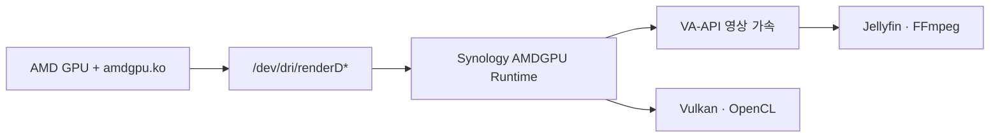

# Synology AMDGPU Runtime — 사용자 요약 릴리즈 노트

> 대상 버전: **0.3.3 ~ 0.4.1**

Synology AMDGPU Runtime은 DSM에 이미 `amdgpu.ko` 커널 모듈이 설치되어 있고 AMD GPU가 정상 인식된 환경에, AMD GPU용 영상·그래픽 사용자 공간 라이브러리를 추가하는 SPK입니다.



## 무엇을 할 수 있나요?

- Jellyfin에서 AMD GPU의 **VA-API 하드웨어 트랜스코딩**을 사용할 수 있습니다.
- SynologyCommunity FFmpeg 7/8에 AMD용 `libdrm`, `libva`, Mesa RadeonSI, RADV Vulkan, Rusticl OpenCL 런타임을 연결합니다.
- `vainfo`, `vulkaninfo`, `amdgpu_top`으로 GPU 런타임과 사용량을 확인할 수 있습니다.
- OpenCL/Rusticl 환경을 포함하므로, 호환되는 Jellyfin·FFmpeg 구성에서는 HDR 톤 매핑 경로에도 사용할 수 있습니다.

## Jellyfin 자동 설정

Jellyfin 패키지가 설치돼 있으면 AMDGPU Runtime은 다음을 자동으로 처리합니다.

| 항목 | 적용 내용 |
| --- | --- |
| FFmpeg 경로 | `/var/packages/ffmpeg7/target/bin/ffmpeg` 대신 AMD 래퍼를 사용 |
| 실제 래퍼 | `/var/packages/syno-amdgpu-runtime/target/bin/amdgpu-ffmpeg` |
| 하드웨어 가속 | VA-API, `/dev/dri/renderD128`, H.264·HEVC 인코딩 기본값 |
| 디코딩 코덱 | H.264, HEVC, MPEG-2, VC-1, VP8, VP9 |
| 트랜스코딩 임시 경로 | 비어 있을 때 `/dev/shm/jellyfin` 자동 설정 |
| 적용 방식 | 설정이 실제로 바뀐 경우에만 Jellyfin을 한 번 재시작 |

AMD 래퍼는 원래 FFmpeg 7 실행 파일을 그대로 사용합니다. 대신 AMD VA-API·Vulkan·OpenCL 런타임 경로를 먼저 적용합니다.

```text
기존 FFmpeg
--ffmpeg /var/packages/ffmpeg7/target/bin/ffmpeg

AMDGPU Runtime 적용 후
--ffmpeg /var/packages/syno-amdgpu-runtime/target/bin/amdgpu-ffmpeg
```

> [!NOTE]
> 설치 또는 업그레이드 중 Jellyfin 설정이 실제로 변경되면 재생·트랜스코딩 세션이 한 번 끊길 수 있습니다. 사용자 지정 FFmpeg 경로나 비어 있지 않은 트랜스코딩 임시 경로는 자동으로 덮어쓰지 않습니다.

## Plex Media Server 연결

Plex Media Server는 자체 Transcoder를 사용합니다. 보안상 AMDGPU Runtime은 Plex 실행 파일을 자동 교체하지 않으며 Plex 소유 경로에 root 권한으로 쓰지 않습니다. 이전 버전에서 생성한 Plex 래퍼가 남아 있으면 업그레이드 과정에서 정규 파일·심볼릭 링크 여부를 검증한 뒤 원본만 복원합니다.

> [!WARNING]
> DSM 커널 4.4의 AMD VA-API는 실험적이며 Plex 자동 연결 대상에서 제외됩니다. GPU hang 또는 `BUG: unable to handle kernel paging request`가 발생한 시스템은 반드시 재부팅하십시오.

## 코덱 지원 범위

이 패키지는 AMD RadeonSI VA-API 런타임을 제공합니다. 실제 하드웨어 지원은 GPU 세대와 FFmpeg 빌드에 따라 달라집니다.

| 기능 | 기본 범위 |
| --- | --- |
| 하드웨어 디코딩 | H.264/AVC, HEVC, MPEG-2, VC-1, VP8, VP9 |
| 하드웨어 인코딩 | H.264, HEVC — GPU와 FFmpeg가 지원할 때 |
| HEVC 10-bit 등 | GPU 세대와 프로파일에 따라 다름 |
| AV1 | 이 패키지에서 공통 기능으로 활성화·검증하지 않음 |

예를 들어 RX 6600은 AV1 **디코딩**을 지원하지만 AV1 **인코딩**은 지원하지 않습니다. 르누아르 Vega 내장 GPU는 AV1 하드웨어 디코딩·인코딩을 지원하지 않습니다.

## 설치 전 확인 사항

다음 조건이 필요합니다.

```bash
ls -l /dev/dri/renderD*
dmesg | grep amdgpu
```

- DSM 7.4 x86_64 환경
- 이미 로드된 `amdgpu.ko`
- `/dev/dri/renderD*` 장치
- 해당 GPU용 AMD 펌웨어

이 SPK는 **커널 드라이버를 설치하지 않습니다.** AMDGPU-PRO, ROCm, CUDA도 포함하지 않습니다.

## 플랫폼별 파일 선택

SPK 파일명에는 버전·DSM·플랫폼이 포함됩니다.

```text
syno-amdgpu-runtime-0.3.5-7.4-epyc7002.spk
```

NAS의 플랫폼과 같은 파일을 선택해야 합니다. 현재 DSM 7.4용으로 제공되는 플랫폼은 다음과 같습니다.

- `epyc7002`, `epyc7003`, `icelaked`
- `r1000nk`, `v1000nk`, `geminilakenk`

## 버전별 핵심 변화

| 버전 | 핵심 내용 |
| --- | --- |
| 0.3.3 | VA-API·RADV Vulkan·Rusticl OpenCL 런타임과 GPU 진단 도구 제공 |
| 0.3.4 | Jellyfin 패키지 자동 감지 및 FFmpeg VA-API 래퍼 자동 연결 |
| 0.3.5 | `/dev/shm/jellyfin` 기본 작업 공간, 변경 시 Jellyfin 1회 재시작 |
| 0.4.1 | privilege helper가 참조하는 runtime payload를 root 소유·비쓰기 상태로 고정하고, Plex 실행 파일 자동 교체를 중단하며 이전 래퍼는 안전 복원 |
